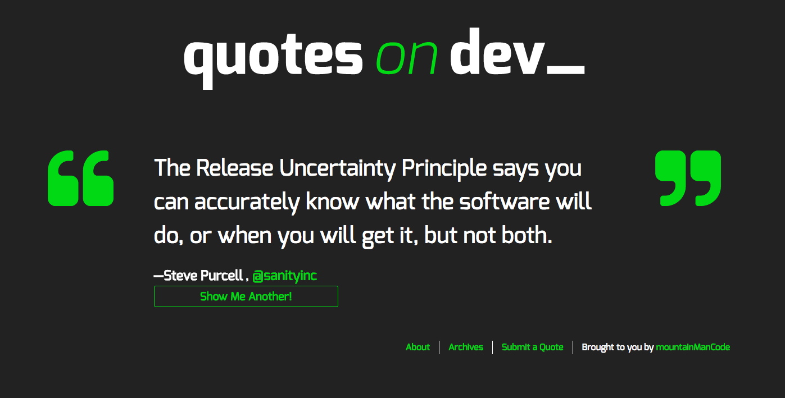

# Quotes on Dev Starter

A WordPress starter theme for the Quotes on Dev project, forked from Underscores. The site is heavily inspired by Chris Coyier’s Quotes on Design. It was a sandbox of playing with tools such as: AJAX, WP api, and jQuery.

  

## Technology Used
* HTML5
* CSS3
* Javascript - jQuery
* PHP

## Built With
* Wordpress
* Visual Studio - Code Editor
* Gulp - task runner
* Git - Github
* Chrome - dev tools

## Installation

### 1. Download me (don't clone me!)

Then add me to your `wp-content/themes` directory.

### 3. Install the dev dependencies

Next you'll need to run `npm install` **inside your theme directory** to install the npm packages you'll need for Gulp, etc.

### 4. Update the proxy in `gulpfile.js`

Lastly, be sure to update your `gulpfile.js` with the appropriate URL for the Browsersync proxy (so change `localhost[:port-here]/[your-dir-name-here]` to the appropriate localhost URL).

## Authors

* **Aaron Griffiths** - (https://github.com/mountainmancode)

## Contributors

* Thank you Rose and Jim of Red Academy for leading the charge on the project.
* Fall 2017 Cohort.

## Observations
* Quotes on Dev was an enjoyable project to work on. It was great to see my skills working with api's/ajax have improved.
